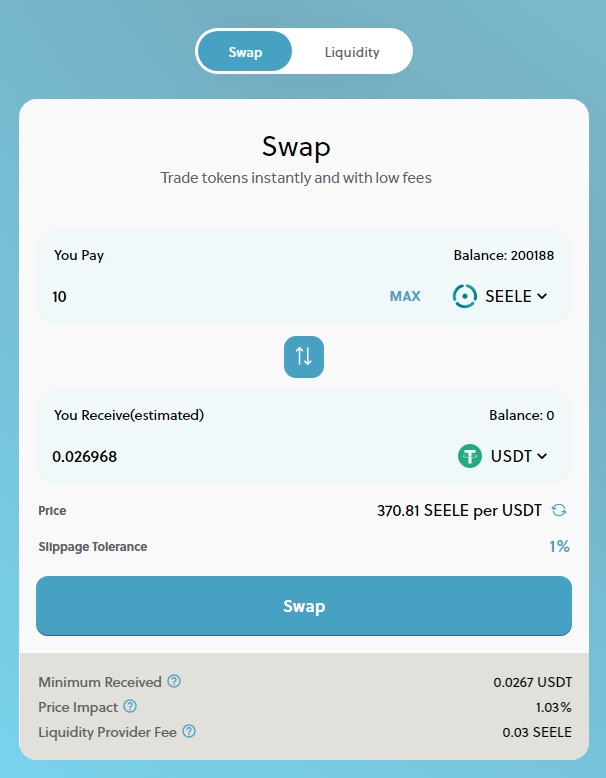

# 💱 Exchange


**More tokens to come:** during the launch phase, the CandySwap team will curate the list of tokens supported. As the platform matures, the listing of tokens will become permissionless.


## The basics

Candy swap is a feature to seamlessly swap tokens instantly without a centralized Order Book like in traditional centralized exchanges for a tiny fee.&#x20;

Users pay a 0.3% trading fee that is shared between the Liquidity Providers and the CandySwap platform.

## 
